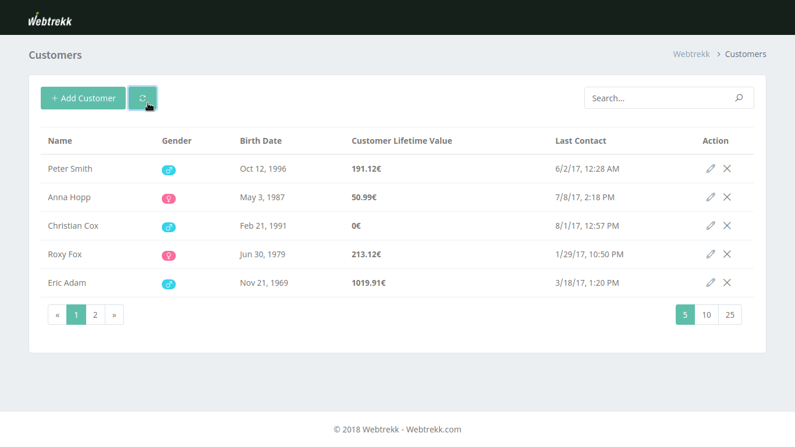

# Customers Manager

This project was generated with [Angular CLI](https://github.com/angular/angular-cli) version 6.2.1. 

## Development server

Run `npm run start:dev` for a dev server. Navigate to `http://localhost:4200/`. The app will automatically reload if you change any of the source files.

## Build

Run `npm run build` to build the project. 

## Production server

After build the project you can run `npm run start` for a prod server. Navigate to `http://localhost:3000/`.

## Running unit tests

Run `npm run test:ui` to execute the unit tests of frontend side via [Karma](https://karma-runner.github.io). 

Run `npm run test:api` to execute the unit tests for the node REST API via [Mocha](https://mochajs.org).

## Deployment application

This application deployed by [Heroku](https://heroku.com), so you can manage your customer following this [Link](https://webtrekk-customer-app.herokuapp.com)

